# Kairos-rs

A production-ready HTTP gateway and reverse proxy built with Rust, featuring a **modern web-based admin interface** and pioneering AI-powered routing capabilities. **The future of intelligent API gateways!**

[](https://www.rust-lang.org/)
[](https://crates.io/crates/kairos-rs)
[](https://opensource.org/licenses/MIT)
[](https://github.com/DanielSarmiento04/kairos-rs/security)


## What it actually does (right now)

Kairos-rs is a production-ready multi-protocol gateway with modern web UI that:
- ✅ **HTTP/HTTPS**: Routes incoming HTTP requests to backend services based on path patterns
- ✅ **WebSocket**: Real-time bidirectional communication with connection upgrading and message forwarding
- ✅ **FTP**: File Transfer Protocol support with HTTP API wrappers for list/download/upload operations
- ✅ **DNS**: DNS query forwarding with response caching and load balancing across DNS servers
- ✅ Supports dynamic path parameters (e.g., `/users/{id}` → `/users/123`)
- ✅ **JWT Authentication** - Validate bearer tokens with configurable claims and required fields
- ✅ **Advanced rate limiting** - Per-route limits with multiple algorithms (fixed window, sliding window, token bucket)
- ✅ **Circuit breaker pattern** - Automatic failure detection and recovery with per-backend isolation
- ✅ **Load Balancing** - 5 strategies (round-robin, least connections, random, weighted, IP hash)
- ✅ **Retry Logic** - Exponential backoff with configurable policies and retryable status codes
- ✅ **Route Management API** - Dynamic CRUD operations for routes via REST endpoints
- ✅ **Hot-Reload API** - Manual configuration reload and status endpoints
- ✅ **Security features** - CORS policies, request size limits, security headers
- ✅ **Observability** - Prometheus metrics, structured logging, health checks
- ✅ **Configuration hot-reload** - Update routes without service restart
- ✅ **Web Admin UI** - Modern Leptos-based interface with real-time dashboard and metrics
- ✅ **Real-time Metrics** - WebSocket-based live updates for system performance and traffic
- ✅ **Configuration Management** - Complete UI for JWT, rate limiting, CORS, metrics, and server settings
- ✅ **Advanced Metrics Dashboard** - 5 specialized views with performance insights and error analysis
- ✅ **Request/Response Transformation** - Header manipulation, path rewriting, query parameter transformation
- ✅ **Historical Metrics** - Time-series data storage with configurable retention and aggregation
- ✅ **Modular Architecture** - Workspace with separate crates for gateway, UI, CLI, and client

**Current status:** Production-ready multi-protocol gateway supporting HTTP, WebSocket, FTP, and DNS with comprehensive security, reliability, load balancing, request/response transformation, and web-based management interface.

```mermaid
sequenceDiagram
    participant Client
    participant Gateway as API Gateway<br/>(Actix-web)
    participant Auth as Auth Service
    participant Cache as Redis Cache
    participant AI as AI Orchestrator
    participant Provider as AI Provider<br/>(OpenAI/Claude)
    participant DB as Database

    Client->>Gateway: POST /api/v1/chat/completions
    Gateway->>Auth: Validate API Key
    Auth-->>Gateway: ✓ Authorized
    
    Gateway->>Gateway: Rate Limit Check
    Gateway->>Cache: Check cached response
    
    alt Cache Hit
        Cache-->>Gateway: Return cached result
        Gateway-->>Client: 200 OK (from cache)
    else Cache Miss
        Cache-->>Gateway: Not found
        Gateway->>AI: Process AI Request
        
        AI->>AI: Select Provider<br/>(load balance)
        AI->>Provider: HTTP Request<br/>(with retry logic)
        Provider-->>AI: AI Response
        
        AI->>Cache: Store response
        AI->>DB: Log request metadata
        AI->>Gateway: Return result
        
        Gateway-->>Client: 200 OK (streamed)
    end
    
    Gateway->>DB: Log analytics (async)
```



## Protocol Support

Kairos-rs now supports multiple protocols beyond HTTP:

| Protocol | Status | Features |
|----------|--------|----------|
| **HTTP/HTTPS** | Production Ready | Load balancing, circuit breakers, retry logic, JWT auth, rate limiting |
| **WebSocket** | Beta | Bidirectional messaging, connection upgrading, binary/text support |
| **FTP** | Beta | File operations via HTTP API (list, download, upload), authentication |
| **DNS** | Beta | Query forwarding, response caching, load balancing across DNS servers |

See [MULTI_PROTOCOL_GUIDE.md](./docs/MULTI_PROTOCOL_GUIDE.md) for detailed protocol documentation and examples.

## Quick Start

### Option 1: Using Docker (Recommended)

```bash
# Pull the latest multi-platform image (supports AMD64 and ARM64)
docker pull ghcr.io/danielsarmiento04/kairos-rs:latest

# Run with your config.json
docker run -d \
  -p 5900:5900 \
  -v $(pwd)/config.json:/app/config.json:ro \
  -e RUST_LOG=info \
  ghcr.io/danielsarmiento04/kairos-rs:latest

# Or use a specific version
docker pull ghcr.io/danielsarmiento04/kairos-rs:0.2.10
```

**With Docker Compose:**

```yaml
services:
  kairos-gateway:
    image: ghcr.io/danielsarmiento04/kairos-rs:latest
    container_name: kairos-gateway
    restart: unless-stopped
    ports:
      - "5900:5900"
    volumes:
      - ./config.json:/app/config.json:ro
    environment:
      - RUST_LOG=info
      - KAIROS_HOST=0.0.0.0
      - KAIROS_PORT=5900
```

**Debugging containers:**
```bash
# The image uses distroless:debug with busybox shell
docker exec -it kairos-gateway sh
```

### Option 2: Build from Source

### 1. Clone and Build
```bash
git clone https://github.com/DanielSarmiento04/kairos-rs.git
cd kairos-rs
cargo run --bin kairos-gateway
```

Gateway starts on `http://localhost:5900`

### 2. Start Web Admin UI (Optional)
```bash
# Install cargo-leptos (one-time)
cargo install cargo-leptos

# Start UI in development mode
cd crates/kairos-ui
cargo leptos serve
```

Admin UI available at `http://localhost:3000`

### 3. Configure Routes
Create a `config.json` file with advanced features:

```json
{
  "version": 1,
  "jwt_secret": "your-secret-key-here",
  "rate_limit": {
    "algorithm": "token_bucket",
    "requests_per_second": 100,
    "burst_size": 10
  },
  "routers": [
    {
      "external_path": "/cats/{id}",
      "internal_path": "/{id}",
      "methods": ["GET"],
      "auth_required": false,
      "backends": [
        {"host": "https://http.cat", "port": 443, "weight": 1}
      ],
      "load_balancing_strategy": "round_robin"
    },
    {
      "external_path": "/api/users/{id}",
      "internal_path": "/v1/user/{id}",
      "methods": ["GET", "POST"],
      "auth_required": true,
      "backends": [
        {"host": "http://api1.example.com", "port": 8080, "weight": 3},
        {"host": "http://api2.example.com", "port": 8080, "weight": 2},
        {"host": "http://api3.example.com", "port": 8080, "weight": 1}
      ],
      "load_balancing_strategy": "weighted",
      "retry_config": {
        "max_retries": 3,
        "initial_backoff_ms": 100,
        "max_backoff_ms": 5000,
        "backoff_multiplier": 2.0,
        "retryable_status_codes": [502, 503, 504]
      }
    }
  ]
}
```

### 3. Test It

#### HTTP Endpoints
```bash
# Public endpoint (no auth required)
curl http://localhost:5900/cats/200

# Secure endpoint (requires JWT)
curl -H "Authorization: Bearer YOUR_JWT_TOKEN" \
     http://localhost:5900/api/secure/123
```

#### WebSocket Connection
```bash
# Install wscat
npm install -g wscat

# Connect to WebSocket route
wscat -c "ws://localhost:5900/ws/chat"
```

**Or use the Admin UI** at `http://localhost:3000` to:
- View real-time metrics and dashboard
- Monitor health status
- See request/response statistics
- Track circuit breaker status

### 4. WebSocket Configuration Example

Add to your `config.json`:

```json
{
  "routers": [
    {
      "protocol": "websocket",
      "backends": [
        {
          "host": "ws://localhost",
          "port": 3000,
          "weight": 1
        }
      ],
      "external_path": "/ws/chat",
      "internal_path": "/ws",
      "methods": ["GET"],
      "auth_required": false
    }
  ]
}
```

**📖 See [WEBSOCKET_GUIDE.md](./docs/WEBSOCKET_GUIDE.md) for comprehensive WebSocket documentation.**

## How Dynamic Routing Works

```rust
// Example route configuration
{
  "external_path": "/api/users/{user_id}/posts/{post_id}",
  "internal_path": "/users/{user_id}/posts/{post_id}"
}

// Request: GET /api/users/123/posts/456
// Forwards to: GET /users/123/posts/456
```

The route matcher:
- Uses regex for pattern matching
- Supports unlimited path parameters
- Falls back to static routes for better performance

## Current Architecture

```
                           ┌─────────────────┐
                           │   Web Admin UI  │
                           │  (Leptos 0.8)   │
                           │  Port: 3000     │
                           └────────┬────────┘
                                    │ HTTP
┌─────────────┐    HTTP    ┌───────▼─────────┐    HTTP    ┌─────────────┐
│   Client    │ ────────▶  │  Kairos Gateway │ ────────▶  │  Backend    │
│             │            │   Port: 5900    │            │  Service    │
└─────────────┘            └─────────┬───────┘            └─────────────┘
                                     │
                              ┌──────┴───────┐
                              │ Config.json  │
                              │   Routes     │ 
                              │     JWT      │
                              │ Rate Limits  │
                              └──────────────┘
```

**Architecture Components:**

### Workspace Structure:
```
kairos-rs/
├── crates/
│   ├── kairos-rs/        # Core library (models, routing logic)
│   ├── kairos-gateway/   # Gateway binary (HTTP server)
│   ├── kairos-ui/        # Web admin interface (Leptos SSR)
│   ├── kairos-cli/       # Command-line interface
│   └── kairos-client/    # Rust client library
```

### Core Features:
- Route matcher with compiled regex patterns
- JWT authentication with configurable claims validation
- Advanced rate limiting (token bucket, sliding window, fixed window)
- Circuit breaker for automatic failure handling
- **Request/Response transformation** - Header manipulation, path rewriting, query parameters
- **Historical metrics storage** - Time-series data with retention policies and aggregation
- HTTP client with connection pooling (reqwest)
- Prometheus metrics endpoint
- Structured logging and health checks
- **Real-time web dashboard** with metrics visualization
- **Server-side rendering** with client hydration for optimal performance

## Configuration

### Full Configuration Example with Load Balancing & Retry Logic
```json
{
  "version": 1,
  "jwt_secret": "your-256-bit-secret-key-here",
  "rate_limit": {
    "algorithm": "token_bucket",
    "requests_per_second": 100,
    "burst_size": 50
  },
  "routers": [
    {
      "external_path": "/api/v1/users/{id}",
      "internal_path": "/users/{id}",
      "methods": ["GET", "PUT", "DELETE"],
      "auth_required": true,
      "backends": [
        {"host": "http://backend1.example.com", "port": 8080, "weight": 2, "health_check_path": "/health"},
        {"host": "http://backend2.example.com", "port": 8080, "weight": 1, "health_check_path": "/health"}
      ],
      "load_balancing_strategy": "weighted",
      "retry_config": {
        "max_retries": 3,
        "initial_backoff_ms": 100,
        "max_backoff_ms": 5000,
        "backoff_multiplier": 2.0,
        "retryable_status_codes": [502, 503, 504]
      }
    },
    {
      "external_path": "/public/status",
      "internal_path": "/health",
      "methods": ["GET"],
      "auth_required": false,
      "backends": [
        {"host": "https://public-api.com", "port": 443}
      ],
      "load_balancing_strategy": "round_robin"
    }
  ]
}
```

### Load Balancing Strategies

Kairos-rs supports 5 load balancing strategies:

1. **Round Robin** (`round_robin`) - Distributes requests evenly in circular order
   - Best for: Backends with similar capacity
   - Pros: Simple, stateless, fair distribution
   - Cons: Doesn't consider backend load

2. **Least Connections** (`least_connections`) - Routes to backend with fewest active connections
   - Best for: Backends with varying capacity or long-running requests
   - Pros: Adapts to backend load automatically
   - Cons: Requires connection tracking overhead

3. **Random** (`random`) - Randomly selects a backend
   - Best for: Simple setups, testing
   - Pros: Zero state, no lock contention
   - Cons: May cause uneven distribution with few requests

4. **Weighted** (`weighted`) - Distributes based on backend weights
   - Best for: Backends with different capacities
   - Pros: Fine-grained control over distribution
   - Cons: Requires manual weight configuration

5. **IP Hash** (`ip_hash`) - Routes based on client IP address
   - Best for: Session affinity, sticky sessions
   - Pros: Consistent routing for same client
   - Cons: May cause imbalance with few clients

### Retry Configuration

Configure exponential backoff retry logic per route:

```json
"retry_config": {
  "max_retries": 3,              // Maximum retry attempts
  "initial_backoff_ms": 100,     // Initial delay in milliseconds
  "max_backoff_ms": 5000,        // Maximum backoff delay
  "backoff_multiplier": 2.0,     // Multiplier for exponential backoff
  "retryable_status_codes": [502, 503, 504]  // Which HTTP status codes to retry
}
```

### Request/Response Transformation (NEW in v0.2.12)

Transform requests and responses on-the-fly with powerful transformation rules:

#### Request Transformation

```json
"request_transformation": {
  "headers": [
    {
      "action": "add",
      "name": "X-Forwarded-By",
      "value": "kairos-gateway"
    },
    {
      "action": "remove",
      "name": "Cookie"
    },
    {
      "action": "replace",
      "name": "User-Agent",
      "pattern": "Mozilla/(\\d+\\.\\d+)",
      "replacement": "KairosGateway/$1"
    }
  ],
  "path": {
    "pattern": "^/api/v1/(.+)$",
    "replacement": "/v2/$1"
  },
  "query_params": [
    {
      "action": "add",
      "name": "api_key",
      "value": "secret123"
    },
    {
      "action": "remove",
      "name": "debug"
    }
  ]
}
```

#### Response Transformation

```json
"response_transformation": {
  "headers": [
    {
      "action": "add",
      "name": "X-Powered-By",
      "value": "Kairos Gateway"
    },
    {
      "action": "remove",
      "name": "Server"
    }
  ],
  "status_code_mappings": [
    {
      "from": 404,
      "to": 200,
      "condition": null
    }
  ]
}
```

**Transformation Actions:**
- **add**: Add header/parameter if not exists
- **set**: Set header/parameter (override if exists)
- **remove**: Remove header/parameter
- **replace**: Replace using regex patterns (headers only)

**Use Cases:**
- Remove sensitive headers (Authorization, Cookie)
- Add tracking headers (X-Request-ID, X-Forwarded-*)
- Rewrite API paths (/v1 → /v2)
- Add authentication tokens to backend requests
- Normalize error responses
- Hide backend server information

### Rate Limiting Algorithms
- **fixed_window**: Fixed time windows with request quotas
- **sliding_window**: Smooth rate limiting with sliding time windows  
- **token_bucket**: Burst-friendly with token replenishment

### JWT Configuration
- Supports standard JWT claims validation
- Configurable required claims and audience
- Bearer token extraction from Authorization header

### Route Management API

Kairos-rs provides REST endpoints for dynamic route management:

```bash
# List all routes
GET /api/routes

# Get specific route
GET /api/routes/{path}

# Create new route
POST /api/routes
Content-Type: application/json
{
  "external_path": "/api/new",
  "internal_path": "/v1/new",
  "methods": ["GET"],
  "backends": [{"host": "http://backend", "port": 8080}],
  "load_balancing_strategy": "round_robin"
}

# Update existing route
PUT /api/routes/{path}

# Delete route
DELETE /api/routes/{path}

# Validate route configuration
POST /api/routes/validate
```

### Hot-Reload API

Trigger configuration reload without restarting:

```bash
# Reload configuration from disk
POST /api/config/reload

# Check reload status
GET /api/config/status
```

### Environment Variables
```bash
KAIROS_HOST=0.0.0.0          # Server bind address
KAIROS_PORT=5900             # Server port
KAIROS_CONFIG_PATH=./config.json  # Config file path  
RUST_LOG=info                # Log level
```

## Testing

```bash
# Run all tests in workspace (85+ tests total)
cargo test --workspace

# Run gateway tests only
cargo test --package kairos-rs

# Run UI tests only
cd crates/kairos-ui && cargo test

# Performance tests
cargo test performance_tests -- --nocapture

# Integration tests
cargo test --test integration_tests

# JWT authentication tests
cargo test --test jwt_integration_test

# Rate limiting tests  
cargo test rate_limit

# Circuit breaker tests
cargo test circuit_breaker
```

Current test coverage: **85+ comprehensive tests** covering:
- Route matching and performance
- JWT authentication and authorization  
- Rate limiting algorithms
- Circuit breaker functionality
- Configuration validation
- Error handling scenarios
- Documentation examples
- UI model validation

## What's Next? (Roadmap)

This project has completed Phase 1 (Gateway Core) and Phase 2 (Load Balancing & Advanced Routing)! Here's what's planned:

**Recently completed (v0.2.7):**
- **Load balancing** - 5 strategies (round-robin, least connections, random, weighted, IP hash)
- **Retry logic** - Exponential backoff with configurable policies
- **Route management API** - CRUD operations via REST endpoints
- **Hot-reload API** - Manual configuration reload endpoints
- **Per-backend circuit breakers** - Fault isolation for each backend server

**Recently completed (v0.2.10 - October 2025):**
- **Multi-Protocol Support** - WebSocket, FTP, and DNS protocol handling
- **WebSocket Proxy** - Bidirectional message forwarding with connection upgrading
- **Docker Multi-Platform Support** - AMD64 and ARM64 container images
- **Automated Versioning** - Docker images tagged from Cargo.toml version
- **Debug-Enabled Containers** - Distroless debug images with shell access for troubleshooting
- **FTP Gateway** - File operations (list, download, upload) via HTTP API
- **DNS Forwarding** - Query forwarding with caching and load balancing
- **Protocol-specific routing** - Configure protocol type per route
- **Comprehensive test coverage** - Integration tests for all protocols

**Recently completed (v0.2.11 - November 2025):**
- **Configuration Management API** - Complete REST API for gateway configuration (6 endpoints)
- **Configuration UI** - Professional interface for JWT, rate limiting, CORS, metrics, and server settings
- **Metrics Visualization** - Advanced metrics dashboard with 5 specialized views
- **Real-time Monitoring** - Auto-refreshing metrics with performance insights
- **Smart Error Analysis** - AI-powered recommendations based on error patterns
- **Traffic Analytics** - Bandwidth visualization and request/response breakdown
- **Circuit Breaker Monitoring** - Real-time circuit breaker status and health tracking

**Current focus (Phase 3 - v0.3.0):**
- [ ] WebSocket real-time updates (replace polling with live connections)
- [ ] Historical metrics with time-series charts
- [ ] Request transformation (header manipulation, path rewriting)
- [ ] Response caching layer
- [ ] Advanced route configuration UI (multi-backend, load balancing)

**Previously completed (Phase 1 + 2 + UI Foundation):**
- JWT authentication with configurable claims
- Advanced rate limiting with multiple algorithms  
- Circuit breaker pattern implementation
- Prometheus metrics endpoint
- Configuration validation and hot-reload
- Comprehensive security features
- **Web Admin UI** with real-time dashboard
- **Workspace architecture** with modular crates
- **Health monitoring** pages
- **Load balancing** - 5 strategies (round-robin, least connections, random, weighted, IP hash)
- **Retry logic** - Exponential backoff with configurable policies

**Future phases:**
- **Phase 3:** Response caching, historical metrics, distributed tracing, WebSocket UI updates
- **Phase 4:** AI-powered routing, LLM integration, smart load balancing
- **Phase 5:** Enterprise features (auth, RBAC, multi-gateway support)

**Exciting AI Vision:**
Kairos-rs is pioneering the integration of AI/LLM capabilities into API gateway functionality:
- **Smart Routing**: AI-driven backend selection based on request content analysis
- **LLM Integration**: Intelligent request/response transformation using language models
- **Predictive Load Balancing**: ML-based routing decisions for optimal performance
- **Behavioral Security**: AI-powered threat detection and dynamic rate limiting

This makes Kairos-rs potentially the **first AI-powered open source API gateway** - combining traditional gateway reliability with cutting-edge AI capabilities.

See [ROADMAP.md](ROADMAP.md) for the complete development plan.

## Contributing

This project needs help! Areas where contributions would be especially valuable:

**Code:**
- **Backend endpoints** - Implement route management API (high priority)
- **UI components** - Build configuration editor forms
- Load balancing implementations
- Request transformation middleware
- Performance optimizations
- Retry logic with backoff strategies
- Historical metrics with charts
- Documentation improvements

**Other:**
- Testing JWT authentication scenarios
- Performance benchmarking under load
- Docker and Kubernetes deployment guides
- Real-world usage examples and case studies
- UI/UX improvements and accessibility

### Development Setup
```bash
# Clone and setup
git clone https://github.com/DanielSarmiento04/kairos-rs.git
cd kairos-rs

# Install dev tools
rustup component add rustfmt clippy
cargo install cargo-leptos  # For UI development

# Run checks
cargo fmt --check --all
cargo clippy --all-targets --all-features
cargo test --workspace

# Start gateway
cargo run --bin kairos-gateway

# Start UI (separate terminal)
cd crates/kairos-ui
cargo leptos serve
```

**Current code style:** Uses default rustfmt with workspace configuration. The codebase follows Rust best practices.

## Performance

Current benchmarks on M1 MacBook Pro:

**Gateway Performance:**
- **Static routes**: ~450k ops/sec (hash map lookup)
- **Dynamic routes**: ~200k ops/sec (regex matching)
- **JWT validation**: ~50k tokens/sec  
- **Rate limiting**: ~100k checks/sec
- **Request latency**: P99 < 2ms for route matching
- **Throughput**: Handles 10k+ concurrent requests reliably

**Resource Usage:**
- **Memory**: ~25MB under load (15MB idle)
- **CPU**: Efficient async runtime with tokio

**UI Performance:**
- **WASM bundle size**: ~500KB (gzipped)
- **Initial page load**: <1s (server-side rendering)
- **Time to interactive**: <2s (client hydration)
- **Dashboard refresh**: Real-time updates every 30s

*Note: These are micro-benchmarks and controlled load tests. Real-world performance depends on backend service latency and network conditions.*

## Known Issues

**Gateway:**
- [ ] Load balancing strategies not yet implemented
- [ ] Request transformation features in development  
- [ ] WebSocket proxying support planned for future release
- [ ] Distributed tracing integration pending

**Admin UI:**
- [ ] Route management needs backend API endpoints (CRUD operations)
- [ ] Configuration editor in development
- [ ] Historical metrics not yet implemented
- [ ] Authentication/authorization for UI pending

**Recently fixed:**
- Configuration validation improved
- Error messages enhanced and structured
- Comprehensive test coverage added
- JWT authentication fully implemented
- Advanced rate limiting algorithms added
- Web UI foundation completed with real-time dashboard

## License

MIT License - see [LICENSE](LICENSE) file.

## AI Development Transparency

This project utilizes AI assistance for:

- **Code Review**: AI tools help identify potential issues and suggest improvements
- **Documentation**: AI assists in maintaining clear and comprehensive documentation  
- **Testing**: AI helps generate test cases and identify edge cases
- **Optimization**: AI provides suggestions for performance improvements

**Human Oversight**: All AI suggestions are reviewed, tested, and validated by human developers before implementation. The core architecture decisions and project direction remain under human control.

We believe in transparency about development tools and methods used in open source projects.

See the prompt guidance in [llm.txt](./llm.txt) for more details.

## Acknowledgments

Built with these excellent Rust crates:

**Core Gateway:**
- [Actix Web](https://actix.rs/) - Web framework
- [Reqwest](https://docs.rs/reqwest/) - HTTP client  
- [Serde](https://serde.rs/) - Serialization
- [Tokio](https://tokio.rs/) - Async runtime
- [jsonwebtoken](https://docs.rs/jsonwebtoken/) - JWT validation
- [prometheus](https://docs.rs/prometheus/) - Metrics collection

**Admin UI:**
- [Leptos](https://leptos.dev/) - Reactive web framework
- [cargo-leptos](https://github.com/leptos-rs/cargo-leptos) - Development tooling
- [WASM-bindgen](https://rustwasm.github.io/wasm-bindgen/) - WASM/JS interop

---

**Status**: Production ready with multi-protocol support (HTTP, WebSocket, FTP, DNS), comprehensive security, reliability, load balancing features, modern web admin interface with configuration management, and advanced metrics visualization  
**Version**: 0.2.11 (November 2025)  
**Maintainer**: [@DanielSarmiento04](https://github.com/DanielSarmiento04)  
**Community**: Issues and PRs welcome!

