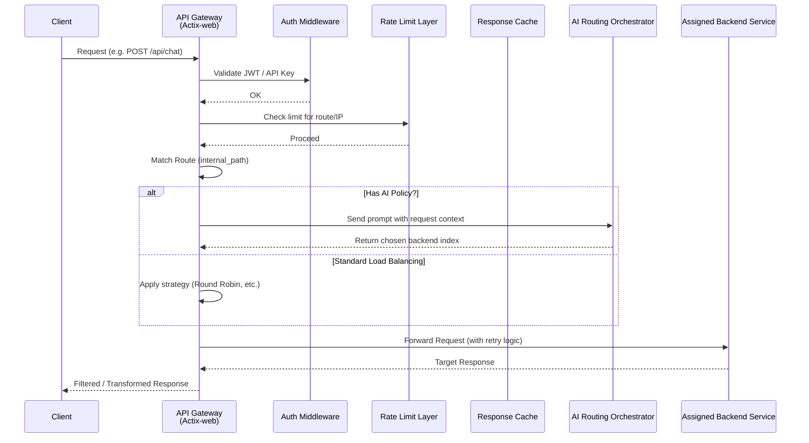

# Architecture & Design

Kairos Gateway is built with a highly modular, multi-crate workspace architecture to ensure maintainability, performance, and clear boundaries of responsibility.

## Workspace Structure

The project is divided into several specialized crates under the `crates/` directory:

### 1. `kairos-rs` (Core Library)
This represents the engine of the gateway. It implements all the core logic without tying it to a specific execution environment.
- **Routing Engine**: HTTP/HTTPS path matching, WebSocket upgrades, FTP, and DNS proxying.
- **Middlewares**: JWT Authentication, Rate Limiting (Token Bucket, Fixed Window, etc.), Request Transformation.
- **Resilience**: Circuit breakers, Retry handlers with exponential backoff.
- **AI Orchestrator**: Integrating with `rig-core` to facilitate intelligent backend selection.
- **Observability**: Prometheus metrics collection, WebSocket metrics streaming.

### 2. `kairos-gateway` (Executable)
The main binary that users run. It wraps `kairos-rs` and connects it to the OS.
- Parses the configuration file (`config.json`).
- Initializes logging and metrics registries.
- Binds to network interfaces and starts the `actix-web` HTTP server.

### 3. `kairos-ui` (Web Dashboard)
A modern administration dashboard built in Rust using **Leptos 0.8**.
- **Server-Side Rendering (SSR)**: Provides fast initial load times and excellent SEO.
- **Server Functions**: Seamless, type-safe API calls between the browser and the Rust frontend server.
- **Real-Time Data**: Uses WebSockets and automated polling to display lively gateway metrics, health statuses, and active connections.

### 4. `kairos-client` (SDK)
A client library provided for developers who want to interact with the Kairos cluster programmatically.
- Used internally by `kairos-ui` and `kairos-cli`.
- Provides typed structs for Metrics, Health, and Configuration APIs.
- Supports both `native` (tokio + reqwest) and `wasm` (gloo-net) targets.

### 5. `kairos-cli` (Command Line Interface)
A terminal-based administration tool.
- Quickly validate `config.json` syntax.
- Request system health and ping metrics.
- Perform dry-run tests for specific route matches.

---

## Request Lifecycle

The diagram below illustrates a typical HTTP request lifecycle passing through the Gateway:

## Resilience & Circuit Breaking

Kairos implements the **Circuit Breaker** pattern to protect struggling backends.
1. **Closed**: Normal state. Traffic flows freely.
2. **Open**: If the backend fails consecutively beyond the threshold, the circuit opens. Requests are immediately rejected (HTTP 503) without overwhelming the backend, allowing it time to recover.
3. **Half-Open**: After a cooldown period, a limited number of test requests are allowed through. If they succeed, the circuit closes. If they fail, it opens again.

This state machine runs independently for every matched backend across the diverse load balancing pools.
