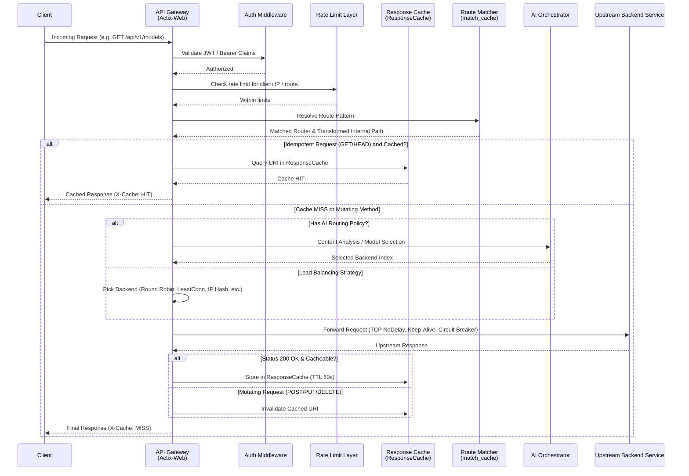

# Architecture & Design

Kairos Gateway is built with a highly modular architecture to ensure maintainability, extreme throughput, sub-millisecond latencies, and clear boundaries of responsibility.

---

## Workspace Structure

The project is divided into several specialized components:

### 1. `kairos-rs` (Core Engine & Library)
The core gateway engine implementing all networking, routing, and policy execution:
- **Routing Engine**: High-performance route matching with pre-compiled regex, $O(1)$ static routing, and **dynamic match caching** (`match_cache`).
- **Response Caching (`ResponseCache`)**: In-memory, lock-optimized response cache with TTL expiration, capacity evictions, and automatic mutation invalidation (`POST`/`PUT`/`DELETE`/`PATCH`).
- **Connection Pool Tuning**: Pre-configured `reqwest` client with `tcp_nodelay(true)`, `tcp_keepalive(60s)`, and pooled upstreams (`pool_max_idle_per_host(128)`).
- **Middlewares & Security**: JWT Authentication, Rate Limiting (Token Bucket, Sliding Window, Fixed Window), Security Headers (HSTS, CSP, X-Frame-Options).
- **Transformations**: Request header injection, header stripping, regex path rewriting, query parameter modification, and response status code mapping.
- **Resilience**: Per-backend circuit breakers, exponential backoff retries.
- **AI Orchestrator**: Content-aware intelligent routing powered by `rig-core`.
- **Observability**: Prometheus `/metrics` exposition and real-time WebSocket metrics streaming (`/ws/admin/metrics`).

### 2. `kairos-gateway` (Server Executable)
The main binary that runs the Actix-Web server:
- Parses and validates configuration (`config.json`).
- Initializes logging, historical metrics storage, in-memory cache, and background tasks.
- Binds to network interfaces and coordinates graceful shutdown.

### 3. `kairos-ui` (`frontend/kairos-ui` SPA)
A decoupled, modern single-page application built with **Vue 3**, **TypeScript**, and **Vite 8**:
- **Real-Time Telemetry Streaming**: Direct WebSocket connection (`/ws/admin/metrics`) with `shallowRef` array buffers for zero-overhead rendering under high log throughput.
- **Interactive Route Editor**: Multi-backend configuration, 5 load balancing algorithms, AI policies, retry settings, and request/response transformations.
- **Cache & Config Observability**: Visual cache performance metrics, one-click cache purge, and configuration hot-reloading (`/api/config/reload`).
- **Developer Tools**: Interactive HTTP/AI prompt playground and JWT token generator/inspector.

### 4. `kairos-client` (Rust SDK)
Client library for interacting with the Kairos cluster programmatically:
- Provides typed structs for Metrics, Health, Routes, and Configuration APIs.
- Supports both `native` (Tokio + Reqwest) and `wasm` targets.

### 5. `kairos-cli` (Command Line Interface)
Terminal administration utility:
- Validate `config.json` syntax.
- Request gateway health and query metrics.
- Perform dry-run route matching tests.

---

## Request Lifecycle

The diagram below illustrates the path of an incoming HTTP request through Kairos Gateway:

```mermaid
sequenceDiagram
    participant Client
    participant Gateway as API Gateway<br/>(Actix-Web)
    participant Auth as Auth Middleware
    participant RateLimiter as Rate Limit Layer
    participant Cache as Response Cache<br/>(ResponseCache)
    participant Matcher as Route Matcher<br/>(match_cache)
    participant AI as AI Orchestrator
    participant Backend as Upstream Backend Service

    Client->>Gateway: Incoming Request (e.g. GET /api/v1/models)
    
    %% Authentication & Authorization
    Gateway->>Auth: Validate JWT / Bearer Claims
    Auth-->>Gateway: Authorized
    
    %% Rate Limiting
    Gateway->>RateLimiter: Check rate limit for client IP / route
    RateLimiter-->>Gateway: Within limits
    
    %% Route Matching
    Gateway->>Matcher: Resolve Route Pattern
    Matcher-->>Gateway: Matched Router & Transformed Internal Path
    
    %% Cache Fast-Path Check
    alt Idempotent Request (GET/HEAD) and Cached?
        Gateway->>Cache: Query URI in ResponseCache
        Cache-->>Gateway: Cache HIT
        Gateway-->>Client: Cached Response (X-Cache: HIT)
    else Cache MISS or Mutating Method
        %% AI / Standard Routing
        alt Has AI Routing Policy?
            Gateway->>AI: Content Analysis / Model Selection
            AI-->>Gateway: Selected Backend Index
        else Load Balancing Strategy
            Gateway->>Gateway: Pick Backend (Round Robin, LeastConn, IP Hash, etc.)
        end
        
        %% Forwarding Upstream
        Gateway->>Backend: Forward Request (TCP NoDelay, Keep-Alive, Circuit Breaker)
        Backend-->>Gateway: Upstream Response
        
        %% Response Caching & Invalidation
        alt Status 200 OK & Cacheable?
            Gateway->>Cache: Store in ResponseCache (TTL 60s)
        else Mutating Request (POST/PUT/DELETE)
            Gateway->>Cache: Invalidate Cached URI
        end
        
        %% Return to client
        Gateway-->>Client: Final Response (X-Cache: MISS)
    end
```

---

## Performance Architectures

### 1. In-Memory Response Caching (`ResponseCache`)
To insulate upstream backends from high-frequency queries and deliver sub-millisecond latencies:
- **Lock-Optimized Storage**: Uses `AHashMap` with atomic counters (`hits`, `misses`, `evictions`) for lock-free metrics.
- **TTL Expiration**: Expired items are purged lazily on lookup or during capacity-triggered batch evictions.
- **Mutation Invalidation**: Any successful mutating write (`POST`, `PUT`, `DELETE`, `PATCH`) automatically purges related cache entries.
- **Management API**: Exposed via `GET /api/cache/stats` and `POST /api/cache/clear`.

### 2. Route Matcher Optimization (`match_cache`)
- Dynamic parameter extraction (`/users/{id}` → `/v1/users/123`) utilizes pre-compiled regular expressions.
- Resolved URLs are stored in an internal thread-safe `match_cache`, bypassing regex capture iterations on repeated paths to achieve $O(1)$ lookups.

### 3. Upstream Connection Pooling
- Outbound requests to microservices and AI providers use persistent TCP connection pools:
  - `tcp_nodelay(true)`: Disables Nagle's algorithm to eliminate packet buffering latency.
  - `tcp_keepalive(60s)`: Retains persistent sockets to avoid handshake renegotiations.
  - `pool_max_idle_per_host(128)`: Accommodates large concurrent bursts without connection churn.

---

## Resilience & Circuit Breaking

Kairos implements the **Circuit Breaker** pattern per upstream service (`host:port`):
1. **Closed**: Normal operation. Requests flow directly to upstream backends.
2. **Open**: When consecutive failures exceed the threshold (default: 5), the circuit trips. Subsequent requests fail fast with `503 Service Unavailable`, preventing cascade failures and allowing backends to recover.
3. **Half-Open**: After a cooldown window (default: 30s), a limited test probe is dispatched. If it succeeds, the circuit closes; if it fails, the open state resets.

---

## Production SSL/TLS Offloading Architecture

In production, Kairos Gateway is recommended to run behind an edge reverse proxy (such as **Nginx**, **Caddy**, **Cloudflare**, or an **AWS ALB**):
- **Edge Reverse Proxy**: Terminates TLS 1.3 / HTTPS, manages automated Let's Encrypt certificates, negotiates HTTP/3 (QUIC), and protects against edge DDoS.
- **Kairos Gateway**: Runs on internal private networks (`:5900`), focusing purely on high-throughput routing, caching, and AI orchestration.

*For complete deployment instructions and configurations, see the [SSL Offloading Guide](SSL_OFFLOADING_GUIDE.md).*
